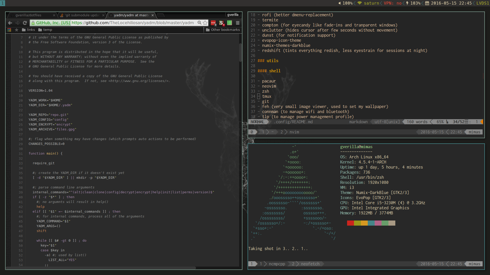
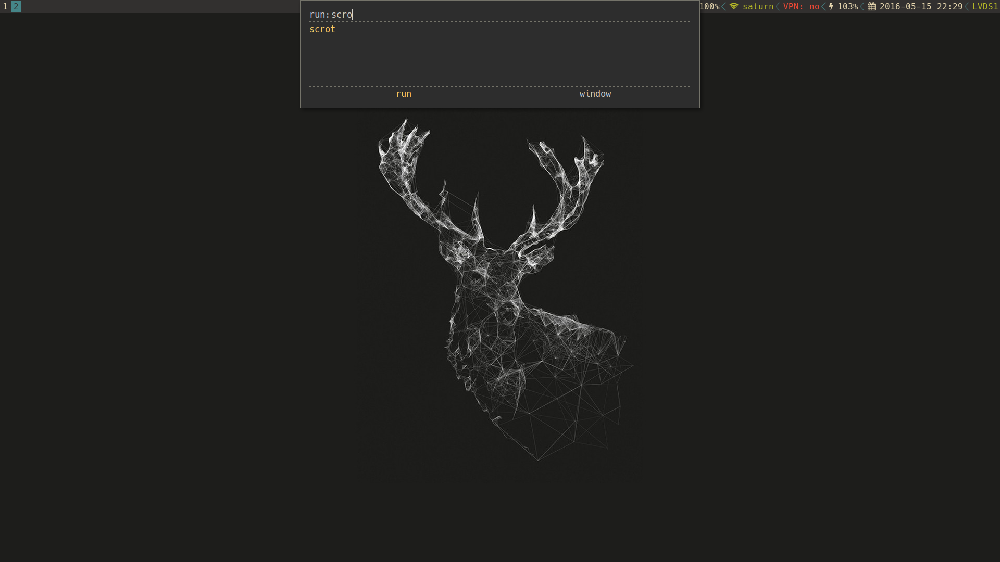

## My dotfiles in action

## Installation

I use [yadm](https://github.com/TheLocehiliosan/yadm) to manage the dotfiles.
To quickly get them up and running, run these commands:

    YADM_DIR=~/.local/share/yadm
    yadm -Y $YADM_DIR clone https://github.com/gverilla/dotfiles $YADM_DIR
    yadm submodule update --init

Note: I try to keep my dotfiles
[XDG-compliant](https://standards.freedesktop.org/basedir-spec/basedir-spec-latest.html)
to avoid as much clutter in my $HOME as possible.
Most of that is handled by my [.zshenv](.config/zsh/zshenv), where I set up the
necessary environment variables and aliases.

## Dependencies and stuff I use

(Every parent entry corresponds to a package in [AUR](https://aur.archlinux.org).)

### wm

- **i3-gaps-next-git** (i3-wm, using patch to add gaps between windows)
- **i3lock-fancy-git** (for a fancy lockscreen)
- **py3status**
- **rofi** (better dmenu-replacement)
- **termite** (nice little terminal)
- **compton** (for eyecandy like fade-ins and tranparent windows)
- **unclutter** (hides cursor after few seconds without movement)
- **dunst** (for notification support)
- **paper-icon-theme-git**
- **gtk-theme-arc**
- **redshift** (tints everything redish, less eyestrain for sessions at night)

### utils

#### shell

- **pacaur**
- **neovim**
- **zsh**
- **tmux**
- **feh** (very small image viewer, used to set my wallpaper)
- **connman** (to manage wifi and bluetooth)
- **tlp** (to manage power management profile)
- **yadm**
- **neofetch**
- **ranger** (CLI file manager)

#### gui

- **thunar** (simple file manager)
- **zathura** (pdf viewer)
- **google-chrome**
- **thunderbird**

### media

- **mopidy** (music player daemon)
  - **mopidy-somafm**
  - **mopidy-spotify**
  - **mopidy-spotify-tunigo**
- **mpc** (cli for mopidy)
- **ncmpcpp** (terminal view for mopidy)
- **sonata** (GUI view for mopidy)
- **vlc**

### fonts

- **ttf-ms-fonts** (windows fonts, for better compatibility)
- **powerline-fonts-git**

